Exercicis
Anàlisi en viu
ICMP
Kali ja té instal·lat Wireshark. Si esteu utilitzant un Ubuntu Desktop, instal·la i configura Wireshark.
Posa en marxa la captura de paquets de Wireshark sobre la targeta de xarxa del teu Kali amb adaptador pont:
- Adreça IP: 192.168.c.x/24 on c és 2 per 2n A i 4 per 2n B i x el teu número de llista.
- Porta d'enllaç: 192.168.c.254
- DNS: 8.8.8.8

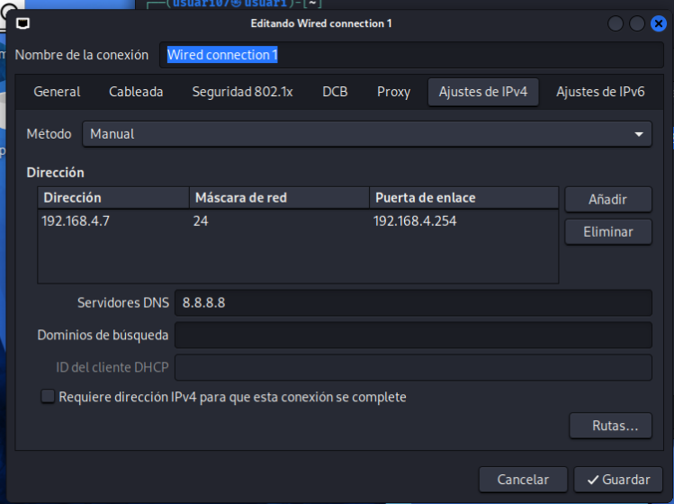

Obre una consola i executa un ping a algun servei o al router de l'escola. Deixa que faci quatre o cinc peticions i atura la comanda (el ping per defecte a Linux no para d'enviar paquets). NOTA: No facis un ping a la teva pròpia màquina perquè els paquets realment no surten de la teva màquina i el Wireshark no els pot capturar.

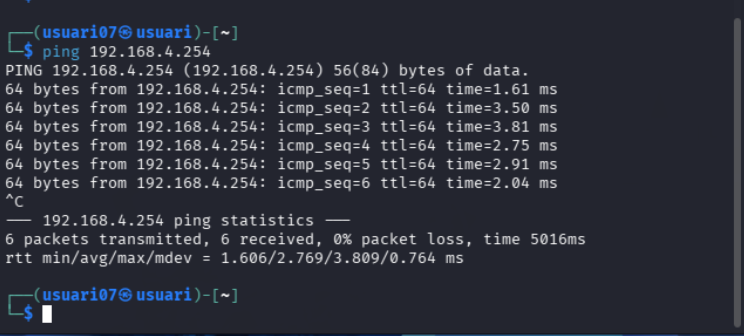

Atura la captura de paquets. Veuràs que s'ha capturat un munt de paquets, sense discriminar, però només volem veure els que fan referència al ping que hem fet.
Per fer-ho, apliquem un filtre de visualització, que permet triar el que volem veure de tot el que s'ha capturat.

Dintre aquest protocol trobem els tipus echo request/reply, que són els que fa servir la comanda ping. Escriurem la paraula icmp a "Filter:".
Quin número de tipus de ICMP té la petició d'eco i quin la resposta d'eco? Com ho veus?.Incorpoar una captura de pantalla on es vegi el tipus de ICMP.

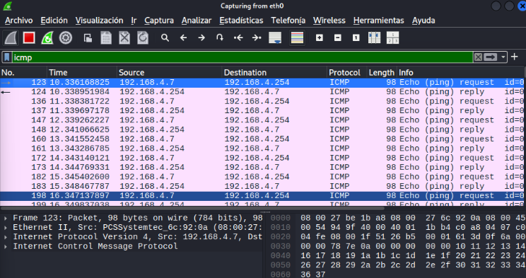

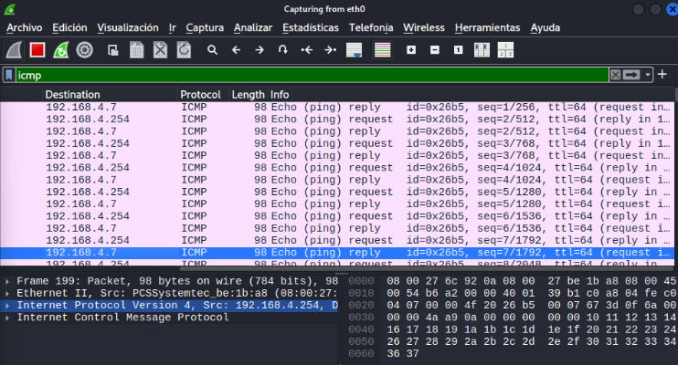

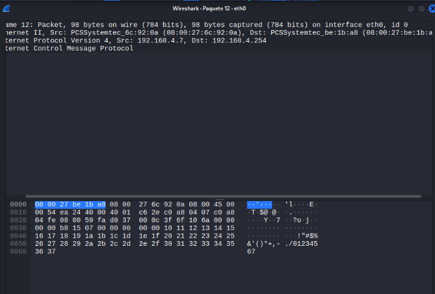

A les opcions avançades de la targeta activa el mode promiscu amb l'opció Permetre-ho tot.

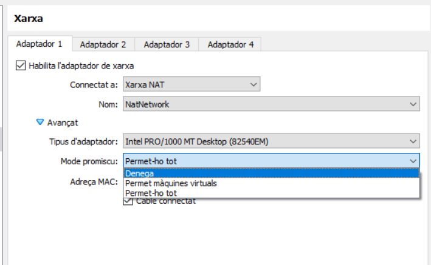

Fes una captura de trànsit, mentre navegues des de la màquina física. Quin trànsit pots veure relacionat amb el teu PC?

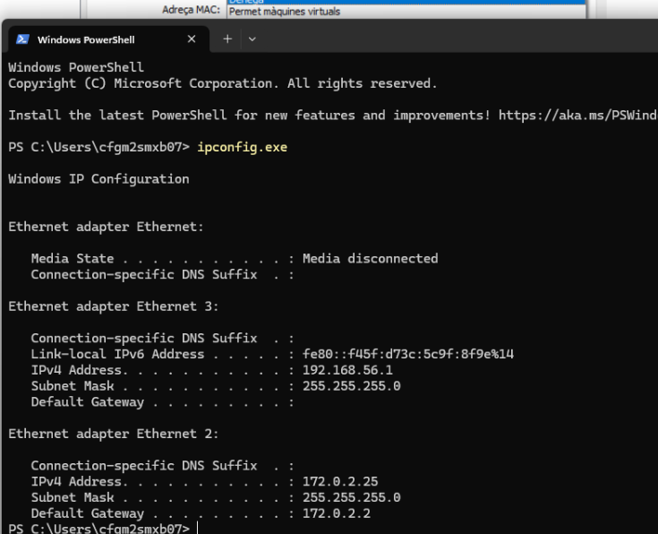

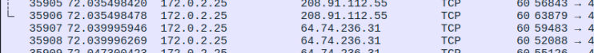

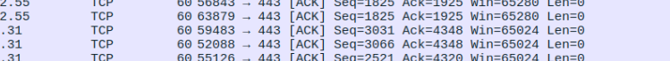

DNS
Centreu l'atenció en el protocol DNS posant un filtre de visualització (protocol DNS i adreça IP d'origen o destí la de la nostra màquina). Veieu la petició de resolució que fa el vostre client?
Comproveu que la resposta del servidor conté l'adreça IP de www.xtec.cat (comproveu amb la comanda nslookup quina és).

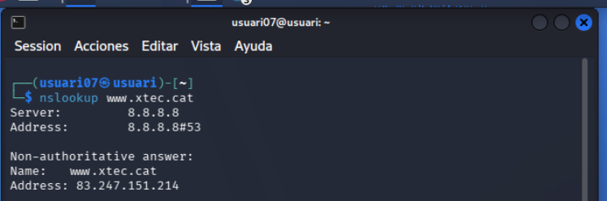

Ara començarem a capturar paquets aplicant un filtre per DNS i, a la terminal, farem un nslookup www.xtec.cat.” 

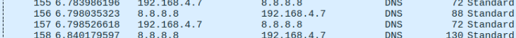

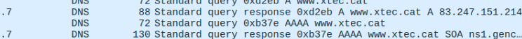

Revisem el primer paquet de resposta 

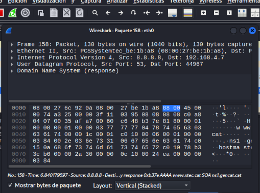

i comprovem que ens ha retornat la IP corresponent 
ARP
Ara mirarem el protocol ARP, que serveix als nostres equips per demanar per broadcast qui te una adreça IP determinada i obtenir la seva adreça MAC.
Quina adreça MAC té el gateway de la xarxa? Quin és el fabricant de la seva NIC?

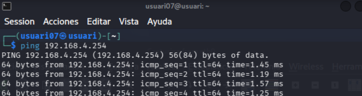

Fem un ping a 192.168.4.254 

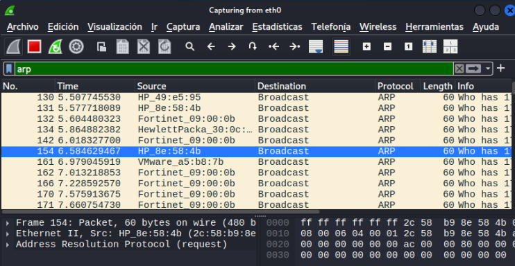

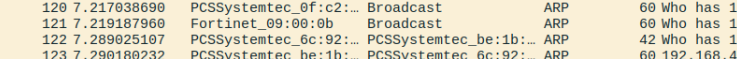

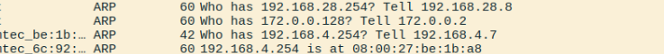

 i, en la captura, busquem les línies who has i is at. La línia is at ens mostra la MAC de la IP que hem fet servir al ping, com a resposta a la petició ARP.

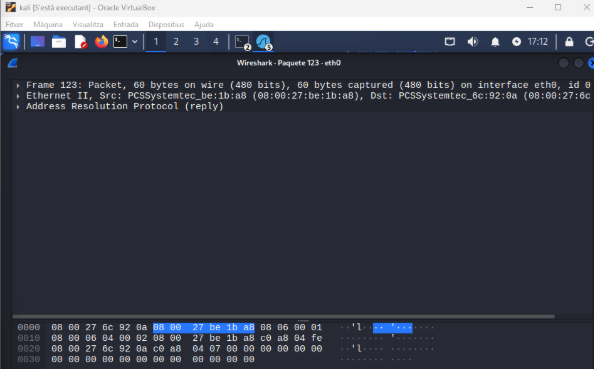

Si obrim el paquet de resposta is at i despleguem la secció Ethernet II, podrem veure el fabricant de la targeta de xarxa (NIC) 

Anàlisi de captura. Arxius
Carrega la captura "captura1.pcapng" que teniu a la carpeta files d'aquest repositori.

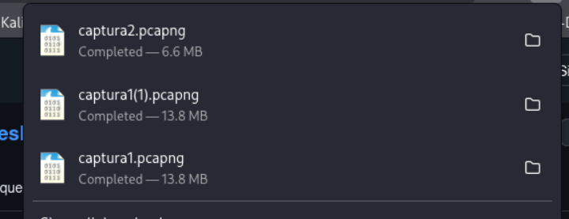

Aconsegueix trobar la següent informació:
1.Al protocol ARP: Pots saber quina adreça MAC té l'equip amb adreça 192.168.1.1? Fes un filtre per a veure només els paquets d'aquesta adreça del protocol ARP.

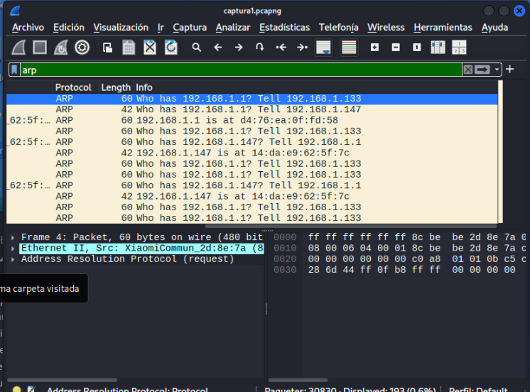

Obrim la primera captura i filtrem per ARP i la IP 192.168.1.1 (arp && ip.addr == 192.168.1.1). Hem de trobar el paquet que diu 192.168.1.1 is at, on apareix la MAC.” 

2.A la sessió FTP:
Quin és el password de l'usuari que inicia sessió? Quin nom té el fitxer que es descarrega del servidor? L’usuari es anonymous i la password contra i el nom del fitxer es README.txt

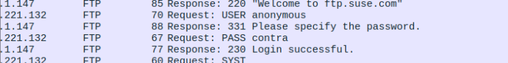

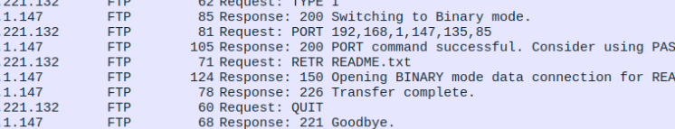

3.A la sessió de Telnet:
Pots veure el que veia l'usuari en connectar al telnet? Explica què és. Quins caràcters composen la nau espacial petita (posar com a resposta)?

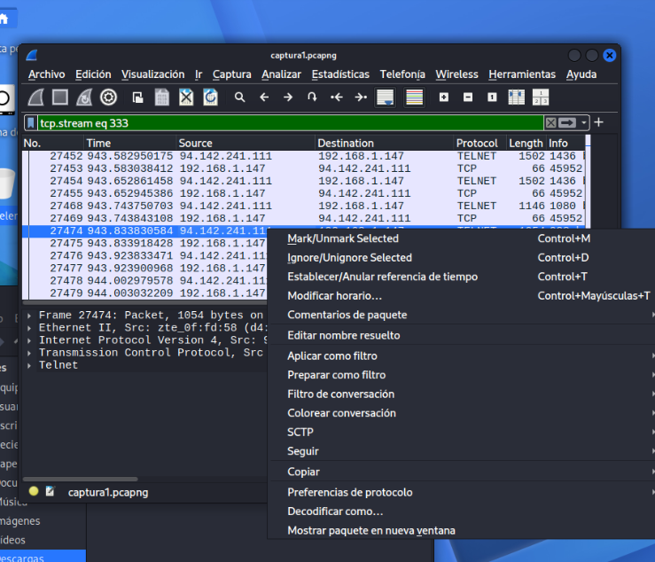

Ara filtrem per telnet, no feu cas al filtratge de la imatge que es va realitzar la captura despres de fer les seguents, per aixo es veu aquest filtre

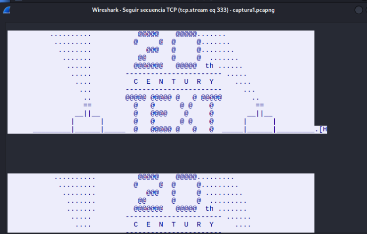

A quin domini pertany l'adreça on ens connectem? No l’he pogut trobar
4.A la sessió SSH:
Pots saber a quin domini pertany l'adreça del servidor? 

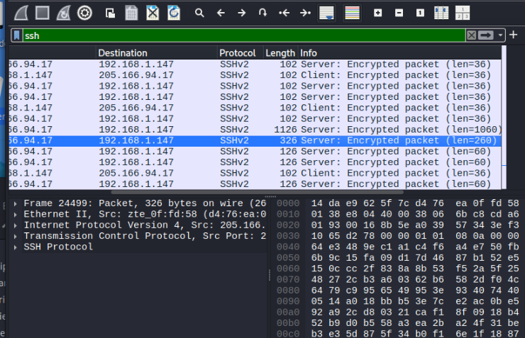

Pots veure el contingut de les dades de la sessió? Enganxa les dades que conté el paquet ssh de longitud total 326 bytes. No perque estan encriptades , i es dades del paquet número 326 les podem veure entrant dins del paquet. 

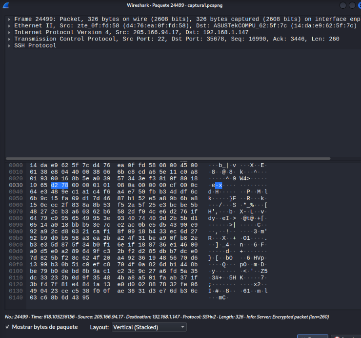

5.Correu electrònic:
Ara carrega l'arxiu "captura2.pcapng" que també teniu al repositori, troba el missatge que s’ha enviat amb el protocol de correu sortint. Extreu el fitxer.
Ara obrim la captura 2, filtrem per SMTP, localitzem el paquet on s’envia el correu i fem clic dret per seguir-lo amb TCP Stream. 

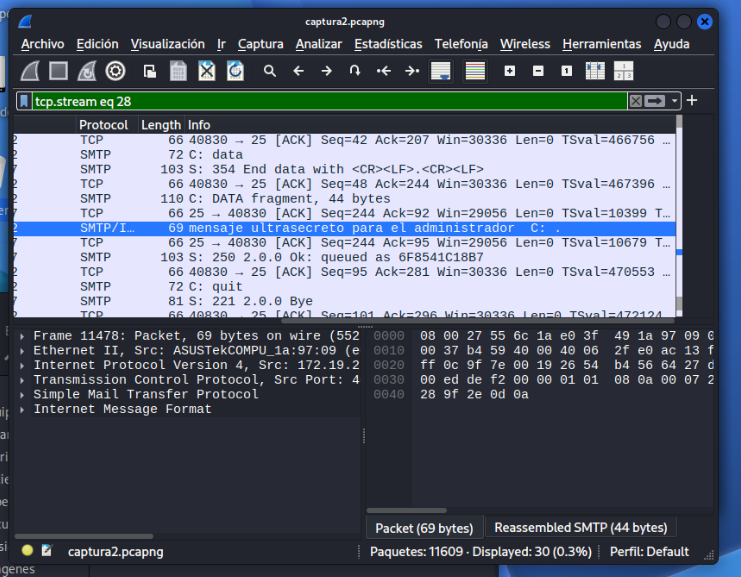

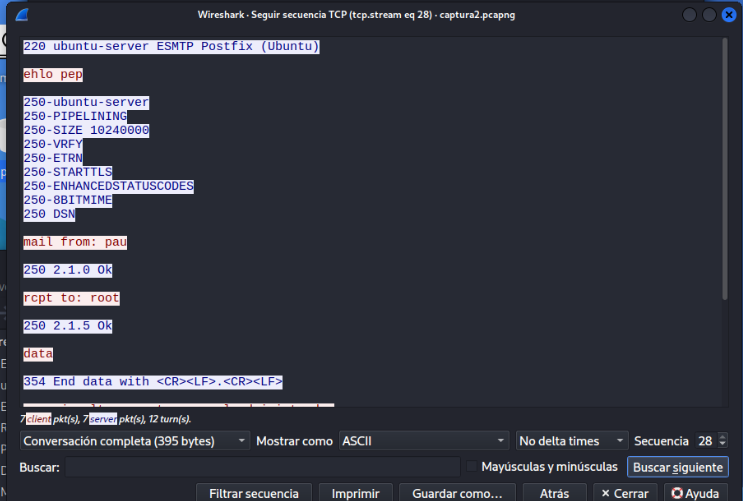

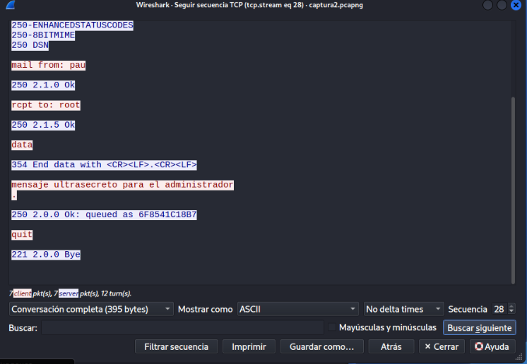

